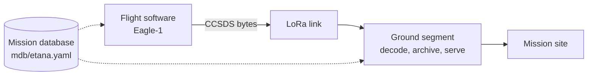

# Etana

High-altitude balloon mission comprising flight software, a CCSDS telemetry
ground segment, and a mission site.

The vehicle, Eagle-1, carries an atmospheric payload (ozone, CO₂) with GPS and
housekeeping instrumentation to approximately 30 km, downlinking telemetry as
CCSDS Space Packets over a LoRa link. The ground segment decodes, archives, and
displays the telemetry in real time.

> **Status.** Ground segment in development. Flight software and mission site are
> planned; their folders are placeholders. This README describes the target
> system.

## Architecture



The mission database (`mdb/etana.yaml`) is the sole definition of packet
structure. The flight software reads it to encode telemetry; the ground segment
reads it to decode telemetry.

The ground segment abstracts the transport behind a packet-source interface,
making the receive path independent of the source of bytes. During development
that source is a simulator emitting the same byte stream the flight software will
produce, which allows the ground segment to be built and tested before flight
hardware exists.

See [`docs/SPECIFICATION.md`](docs/SPECIFICATION.md) and
[`docs/DESIGN.md`](docs/DESIGN.md) for detail.

## Layout

```
etana/
├── mdb/etana.yaml        # mission database — packet definitions
├── ground-segment/       # telemetry receive, decode, archive, dashboard
├── flight-software/      # embedded flight software (planned)
├── website/              # mission site (planned)
└── docs/                 # specification and design
```

## Getting started

Run instructions will be added with the ground-segment services and
`docker-compose.yml` (Phase 3). See [`docs/SPECIFICATION.md`](docs/SPECIFICATION.md)
and [`ground-segment/README.md`](ground-segment/README.md).

## License

Not yet chosen.
