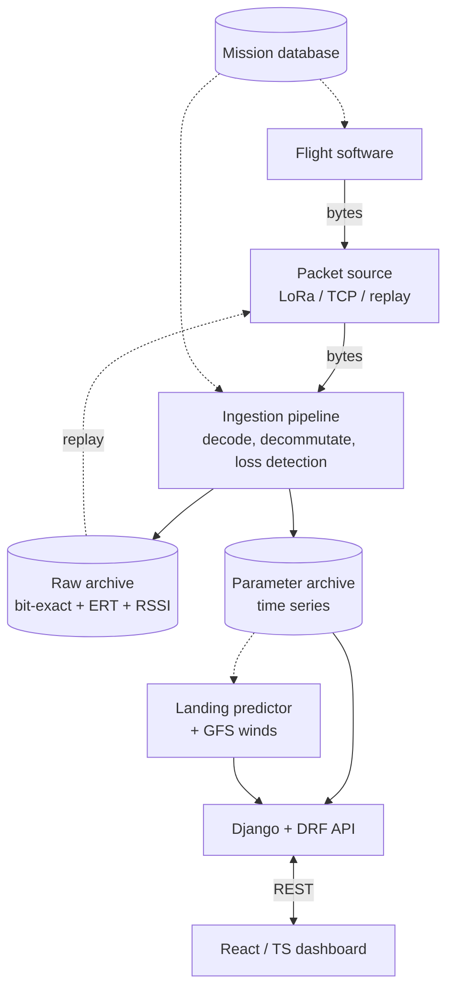
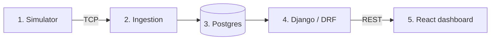

# Etana Ground Segment — Design

Design and build plan for the ground segment. Mission-level context is in
[`SPECIFICATION.md`](SPECIFICATION.md).

The ground segment abstracts the transport behind a single interface,
`IPacketSource`. All components downstream of that interface operate on byte
frames and are independent of whether the bytes originate from the radio, a
development simulator, or a replay of stored data.

## 1. Principles

**The byte stream is the contract.** The flight software emits a defined CCSDS
Space Packet byte layout. During development a simulator emits the identical
layout. The receive path processes bytes and does not distinguish the source.

**A single mission database defines packet structure.** `mdb/etana.yaml` is read
by both the encoder (flight software or simulator) and the decoder (ground
segment). Structure is defined once. The format follows XTCE concepts to allow
migration to XTCE.

**The archive is raw-first.** Every received packet is written bit-exact to the
raw store before decoding, with receipt time and link metadata. Decoded parameter
values are a separate, derived store. Re-decoding the raw store regenerates the
parameter store.

**Calibration is ground-side.** Sensors transmit raw ADC counts. Calibration
curves reside in the mission database. Revised coefficients apply to archived raw
data without re-flight.

**Onboard time and receive time are distinct.** Each packet carries an onboard
timestamp; the ground assigns an Earth-receive time at ingestion. The two diverge
for data recovered from onboard storage, which arrives after flight with in-flight
timestamps.

**Ingestion is framework-independent.** The ingestion path is a long-running
Python service reading from `IPacketSource`. The web layer (Django/DRF) reads the
resulting archive and does not participate in ingestion.

## 2. Phases

### Phase 0 — Codec
Define the mission database format and the CCSDS Space Packet codec (encode and
decode) driven by it. No transport, storage, or web layer.

Exit criterion: a round-trip test passes — encode a packet from field values,
decode it, and assert both the recovered values and the primary-header bytes are
correct.

### Phase 1 — Transport interface and simulator
Define `IPacketSource` and implement `TcpPacketSource`. Implement the simulator as
a TCP server emitting packets on a schedule via the Phase 0 codec. Implement a
minimal ingestion process that reads, decodes, and logs parameters.

Exit criterion: decoded values stream from the simulator through ingestion in real
time.

### Phase 2 — Archive
Provision Postgres. Implement the raw packet store (bytes, ERT, link stats, APID,
sequence count) and the parameter store (decoded time series). Implement per-APID
sequence-gap detection and record loss events.

Exit criterion: a flight run is queryable in Postgres as raw packets and parameter
series; ingestion restart mid-run produces no corruption and records the gap.

### Phase 3 — API and dashboard
Django/DRF over the archive. React/TypeScript dashboard: map track, altitude plot,
per-APID loss indicators, link-margin plot. The full stack — simulator, ingestion,
Postgres, API, dashboard — runs via `docker compose`.

Exit criterion: `docker compose up` from a clean checkout serves the dashboard
with live simulated telemetry.

### Phase 4+ — Extensions
- Landing predictor: forward trajectory integration through NOAA GFS wind data,
  updated during descent. Optional C++ numerical core.
- Cutdown commanding: minimal uplink with telemetry-confirmed execution.
- Replay UI: re-decode the raw archive; backfill from recovered onboard storage.

## 3. Production architecture



The mission database is read by the encoder (flight software) and the decoder
(within ingestion). Components downstream of the packet source are independent of
the transport.

## 4. Prototype architecture (Phases 0–3)

The prototype runs five processes under `docker compose`, with the simulator in
place of flight hardware:



1. Simulator — reads the mission database, walks a flight profile, encodes
   packets, serves them over TCP, injects loss and corruption.
2. Ingestion — `TcpPacketSource` → codec → raw store → decommutation → parameter
   store → gap detection.
3. Postgres — raw and parameter tables.
4. Django/DRF — read-only REST API over the archive.
5. React/TS dashboard — map, plots, loss indicators; polls the API.

Excluded from the prototype: LoRa, landing predictor, commanding, WebSocket push,
authentication, full XTCE. Each is additive against the existing interfaces.

## 5. Repository structure

Monorepo. The mission database is at the top level, shared by flight software and
ground segment.

```
etana/
├── mdb/
│   └── etana.yaml          # mission database — shared contract
├── ground-segment/
│   ├── packages/ccsds/     # codec (pure, no I/O)
│   ├── services/simulator/
│   ├── services/ingestion/
│   ├── services/api/       # Django + DRF
│   └── frontend/           # React + TS
├── flight-software/        # embedded C++ (separate toolchain)
├── website/                # mission site
└── docs/
```

`ccsds` is a pure library with no I/O, usable by both simulator and ingestion.
`ingestion` depends on `ccsds` and the mission database but not on `api`; the web
layer reads the archive ingestion writes, and the two do not import each other.

## 6. First component

Phase 0 begins with `mdb/etana.yaml` (defined) and the `ccsds` codec that reads
it. The codec is the dependency of every other component: the simulator encodes
through it, ingestion decodes through it, the archive schema follows the
parameters it exposes.

Build order:

1. `mission_db.py` — load and validate `etana.yaml` into typed objects.
2. `primary_header.py` — pack/unpack the 6-byte CCSDS primary header.
3. `encoder.py`, `decoder.py` — field encode/decode driven by the mission database.
4. `test_roundtrip.py` — the Phase 0 exit criterion.
