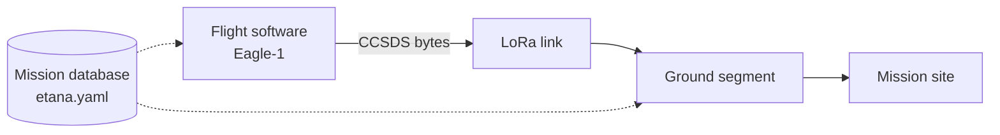

# Etana Mission Specification

Top-level reference for the Etana mission. Component detail lives in each folder's
README and in [`DESIGN.md`](DESIGN.md).

## 1. Overview

Etana is a high-altitude balloon mission. The vehicle, Eagle-1, carries an
atmospheric payload to approximately 30 km, measuring ozone and CO₂ concentration
against altitude while reporting position for tracking and recovery.

Telemetry is downlinked as CCSDS Space Packets over a LoRa link. The ground
segment decodes, archives, and displays the data, and computes a predicted
landing point during descent.

*Etana* is the mission; *Eagle-1* is the vehicle; `etana` is the repository. The
ground segment, flight software, and mission site are components within it.

## 2. Scope

In scope for the first flight:

- Atmospheric measurement (ozone, CO₂ vs. altitude) with recovery of the payload
  and the telemetry archive.
- Real-time vehicle tracking and landing prediction.

Out of scope for the first flight:

- Uplink and commanding, except a possible cutdown. The mission is downlink-only.
- A CCSDS link and channel-coding layer. LoRa provides framing, CRC, and FEC, so
  Space Packets are carried directly in LoRa payloads.
- Full XTCE. The mission database uses a YAML subset of XTCE concepts.

## 3. Architecture

The flight software encodes telemetry to CCSDS bytes; the ground segment decodes
them. Both derive packet structure from the mission database, which is the sole
definition of that structure. The transport is abstracted behind a packet-source
interface in the ground segment, so the receive path is independent of whether
bytes arrive over the radio or from a development simulator (see
[`DESIGN.md`](DESIGN.md)).

## 4. Telemetry

Telemetry is organized into APIDs (CCSDS Application Process Identifiers), one per
stream, each at an independent rate:

| APID | Stream | Rate | Notes |
|------|--------|------|-------|
| 100 | GPS | 1 Hz | Tracking and recovery |
| 200 | Payload (ozone, CO₂) | 0.2 Hz | Sensor response time is seconds |
| 300 | Housekeeping | 0.1 Hz | System health |
| 400 | Events | on occurrence | Discrete flight events |

Parameters are defined in [`../mdb/etana.yaml`](../mdb/etana.yaml) and documented
in [`../mdb/README.md`](../mdb/README.md).

Design decisions:

- Sensors downlink raw ADC counts. Calibration to engineering units is applied
  ground-side, so calibration coefficients can be revised and re-applied to the
  archived raw data without re-flight.
- The archive is two-tier: a bit-exact raw packet store and a decoded parameter
  time series derived from it. The parameter store is regenerable by re-decoding
  the raw store.
- Onboard time and Earth-receive time are recorded separately. The distinction is
  required for correct handling of data recovered from onboard storage after
  landing, which arrives with in-flight timestamps.

## 5. Link

- LoRa, 902–928 MHz ISM band, half-duplex. Framing, CRC, and forward error
  correction are handled by the radio, which is why the CCSDS link and coding
  layers are omitted.
- Spreading factor SF7–9, giving payloads of 100+ bytes. The largest packet is
  22 bytes including the 6-byte primary header.
- Regulatory limits per ISED RSS-247. Power and duty-cycle limits pending RF review.

Link parameters are provisional pending RF review.

## 6. Ground segment

Internal architecture and per-component detail in
[`../ground-segment/README.md`](../ground-segment/README.md). Summary: a
packet-source interface (transport abstraction), a CCSDS codec (byte–value
conversion), an ingestion pipeline (Python service writing both archive tiers and
detecting packet loss), Postgres storage, a Django/DRF read API, and a
React/TypeScript dashboard.

## 7. Development phases

| Phase | Deliverable | Status |
|-------|-------------|--------|
| 0 | CCSDS codec driven by the mission database; round-trip test passing | Complete |
| 1 | Packet-source interface and development simulator over TCP | Complete |
| 2 | Postgres archive (raw + parameter) with per-APID loss detection | Complete |
| 3 | Django API and React dashboard; full stack via `docker compose` | Next |
| 4+ | Landing predictor; cutdown commanding; replay UI; mission site | Planned |

Phases 0-2 are complete: the codec, the transport seam, a simulator that flies a
realistic profile with injected link loss, an ingestion pipeline that archives to
Postgres with per-APID loss detection, and replay/recalibration from the raw
archive. The ground segment is developed against the simulator, which emits the
same CCSDS byte stream the flight software will produce, so the receive path is
built and tested before flight hardware exists. Phase detail in
[`DESIGN.md`](DESIGN.md).

## 8. Open items

- Repository license.
- Whether a cutdown uplink is built.
- Retention of `last_rssi` given a downlink-only first flight.
- Final LoRa parameters, pending RF review.
