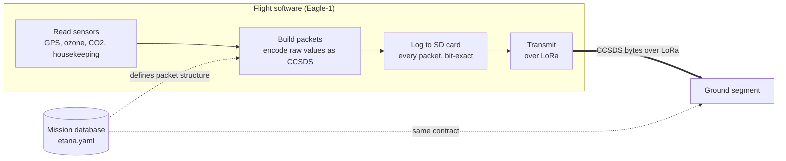

# Flight Software

Embedded software for the Eagle-1 payload. Reads sensors, builds CCSDS Space
Packets per the mission database, logs every packet to onboard storage, and
transmits over the LoRa link.

> **Status.** Planned. Not started. This README describes the intended design so
> the work can begin in parallel with the ground segment.

## Where it fits

The flight software is the mirror image of the ground segment's receive path.
The ground segment *decodes* CCSDS bytes; the flight software *encodes* them.
Both derive packet structure from the same mission database — that shared file is
the contract that lets the two sides be built independently.

## Responsibilities

The flight software must, in order:

1. **Read sensors** — sample GPS, the atmospheric payload (ozone, CO2), and
   housekeeping (battery, temperatures) at each stream's rate. Rates are defined
   per container in the mission database (GPS 1 Hz, payload 0.2 Hz, housekeeping
   0.1 Hz).
2. **Encode packets** — pack each reading into a CCSDS Space Packet exactly as
   the mission database specifies: correct APID, field order, byte sizes, and a
   per-APID sequence counter. Sensors report *raw* values (ADC counts, scaled
   integers); calibration to engineering units happens on the ground.
3. **Log onboard** — write every packet bit-exact to SD storage before (or
   alongside) transmitting, so data survives link dropouts and can be recovered
   after landing.
4. **Transmit** — send packets over the LoRa radio.

## The contract with the ground segment

The interface between flight and ground is the byte layout defined in
[`../mdb/etana.yaml`](../mdb/etana.yaml). The flight software's encoder must
produce bytes the ground segment's decoder accepts.

The ground segment includes a reference encoder (the `ccsds` package, in Python)
that can serve as an oracle: for a given set of field values, the flight
software's output bytes should match the reference encoder's output byte-for-byte.
This makes conformance testable without a radio — compare bytes, not behaviour.

## Open questions

- Microcontroller and toolchain (dictates the C/C++ environment).
- LoRa module and its driver.
- Whether onboard logging and transmission are concurrent or sequential.
- Cutdown command handling, if an uplink is built (coordinate with the recovery
  system and the ground segment's commanding path).

Held in this monorepo for a single mission history; separable into its own
repository later if it develops an independent release cadence.
