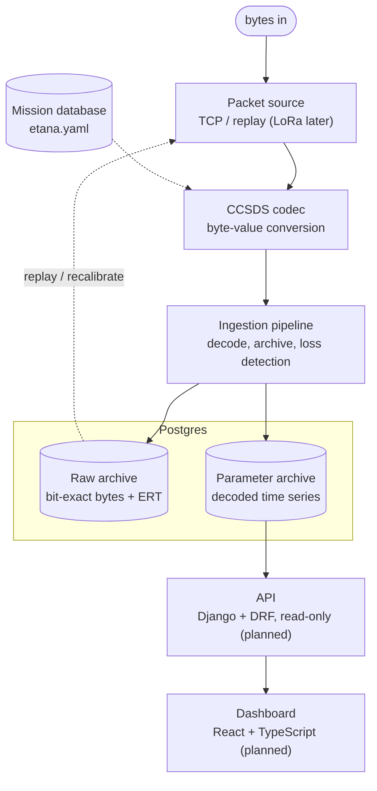

# Ground Segment

Receives, decodes, archives, and (soon) serves Eagle-1 telemetry. Python
ingestion, Postgres archive, with a Django/DRF API and React dashboard planned.

> **Status.** Phases 0-2 complete and runnable: the CCSDS codec, the transport
> seam, a simulator that flies a realistic profile with injected link loss, an
> ingestion pipeline that decodes and archives to Postgres with per-APID loss
> detection, and replay/recalibration from the raw archive. The REST API and
> dashboard (Phase 3) are not yet built.

## Architecture



The ingestion path (packet source → codec → archive) is a long-running Python
process, built and working. The read path (database → API → dashboard) is
planned for Phase 3. The two meet at Postgres.

The transport is abstracted behind the packet-source interface: `TcpPacketSource`
now, `ReplayPacketSource` for re-reading the archive, and `LoRaPacketSource` for
the flight radio later. Nothing downstream of the interface depends on the source
— which is why replaying stored packets uses the identical decode/archive path.

## Components

| Component | Responsibility | Stack | Status |
|-----------|---------------|-------|--------|
| CCSDS codec | Byte-value conversion per the mission database; no I/O | Python | Built |
| Packet source | Transport seam; frames a byte stream into packets | Python | Built (TCP, replay) |
| Simulator | Flies a realistic profile; emits CCSDS over TCP with injected loss | Python | Built |
| Ingestion pipeline | Decode → archive → per-APID gap detection | Python | Built |
| Raw archive | Bit-exact bytes, Earth-receive time, link stats | Postgres | Built |
| Parameter archive | Decoded, calibrated time series; regenerable from raw | Postgres | Built |
| Replay / recalibrate | Re-decode stored raw with updated calibration, no re-flight | Python | Built |
| API | Read-only REST over the archive | Django + DRF | Planned (Phase 3) |
| Dashboard | Map, plots, loss indicators | React + TS | Planned (Phase 3) |

## Setup

The services are installable Python packages; Postgres runs in Docker.

```
# 1. Install the packages (editable)
pip install -e packages/ccsds
pip install -e "services/simulator[dev]"
pip install -e "services/ingestion[dev]"
pip install -e "services/api[dev]"

# 2. Start Postgres (from ground-segment/)
cp .env.example .env          # edit credentials if you like
docker compose up -d          # wait for 'healthy' in: docker compose ps

# 3. Create the archive tables (once)
cd services/api && python manage.py migrate
```

If port 5432 is taken (e.g. a native Postgres), set `POSTGRES_PORT=5433` in
`.env` and recreate the container.

## Running a flight

The simulator (TCP server) flies and streams; the ingestion runner (TCP client)
decodes, archives, and detects loss. Run both with one command from
`ground-segment/`:

```
python run_demo.py --speed 60
```

Or run them separately in two terminals:

```
# terminal 1 — simulator (from services/simulator)
python -m simulator.main --speed 60

# terminal 2 — ingestion (from services/ingestion)
python -m ingestion.main
```

`--speed` is sim-seconds per real-second (`1` = real time; higher compresses the
~2.3-hour flight). Ingestion archives to Postgres by default; add `--no-archive`
to decode and display only (no database needed).

Simulator link-loss controls: `--loss 0.05` sets the background loss rate,
`--no-pathology` sends a clean stream, `--seed N` makes loss reproducible.

## Inspecting the archive

```
# Django shell (from services/api)
python manage.py shell
>>> from telemetry.models import RawPacket, ParameterSample, LossEvent
>>> RawPacket.objects.count()
>>> ParameterSample.objects.filter(parameter_name="gps_altitude").order_by("onboard_time")

# or SQL directly (from ground-segment)
docker compose exec postgres psql -U etana -d etana -c \
  "SELECT apid, COUNT(*) FROM telemetry_rawpacket GROUP BY apid;"
```

## Replay and recalibration

The raw archive is the source of truth; parameter samples are derived and
regenerable. After updating calibration coefficients in `mdb/etana.yaml`,
re-decode the stored raw packets to regenerate corrected values with no re-flight:

```python
# from services/api, in `python manage.py shell`
from ccsds import load_mission_db
from telemetry import archive
db = load_mission_db("../../../mdb/etana.yaml")
archive.reprocess(db, dry_run=True)    # report what would change, write nothing
archive.reprocess(db, dry_run=False)   # regenerate samples (transactional)
```

Reprocess runs in a single transaction (a failure rolls back), never modifies raw
packets, and can always be re-run. Comparing two calibrations needs no versioning:
because raw is immutable, any calibration's output is derivable from it on demand.

## The API

A read-only REST API (Django REST Framework) serves the archive over HTTP. Run
the development server from `services/api`:

```
python manage.py runserver
```

Endpoints (all under `/api/`), each returning JSON the dashboard consumes:

| Endpoint | Returns |
|----------|---------|
| `GET /api/flights/` | All flights, with packet counts |
| `GET /api/flights/{id}/` | One flight's detail |
| `GET /api/flights/{id}/parameters/` | Parameter names available for the flight |
| `GET /api/flights/{id}/series/{parameter}/` | A parameter's full time series |
| `GET /api/flights/{id}/latest/` | Most recent GPS state (the moving dot) |
| `GET /api/flights/{id}/loss/` | Per-APID loss totals (the loss badges) |
| `GET /api/flights/{id}/events/` | The flight's events, in order |

Ingestion opens a flight record when it starts and associates every packet and
loss event with it, so the archive holds many flights and the API serves each
independently. The API only reads; ingestion is the sole writer.

## Layout

```
ground-segment/
├── run_demo.py             # runs simulator + ingestion together
├── docker-compose.yml      # Postgres for the archive
├── packages/
│   └── ccsds/              # mission-database-driven codec
├── services/
│   ├── simulator/          # flight model, telemetry, link pathology, TCP server
│   ├── ingestion/          # packet sources (tcp, replay), gap detection, runner
│   └── api/                # Django archive: models, archive writer, reprocess
└── frontend/               # React + TypeScript dashboard (planned)
```

## Tests

```
cd packages/ccsds && pytest             # codec
cd services/ingestion && pytest         # framing, gap detection
cd services/simulator && pytest         # flight model, telemetry, pathology
cd services/api && python manage.py test   # archive + reprocess (Django runner)
```

Note the api package uses Django's test runner, not pytest. CI runs all four
across Python 3.10-3.12.
