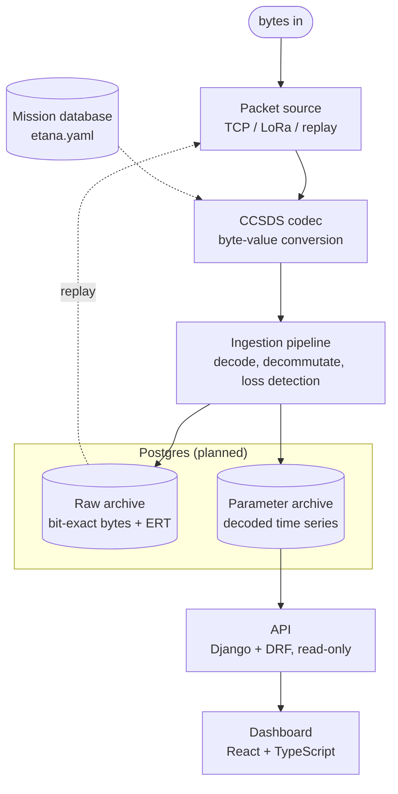

# Ground Segment

Receives, decodes, archives, and displays Eagle-1 telemetry. Python ingestion,
Django/DRF API, React/TypeScript dashboard, Postgres storage.

> **Status.** Phases 0 and 1 complete and runnable: the CCSDS codec, the
> transport seam, and a simulator that streams a full flight to the ingestion
> runner. Persistence, API, and dashboard are not yet built.

## Architecture



## Components

| Component | Responsibility | Stack | Status |
|-----------|---------------|-------|--------|
| CCSDS codec | Byte-value conversion per the mission database; no I/O | Python | Built |
| Packet source | Transport abstraction; frames byte stream into packets | Python | Built (TCP) |
| Simulator | Emits a simulated flight as CCSDS packets over TCP | Python | Built |
| Ingestion runner | Connects to a source, decodes, displays telemetry | Python | Built (no archive yet) |
| Raw archive | Bit-exact received bytes, Earth-receive time, link stats | Postgres | Planned (Phase 2) |
| Parameter archive | Decoded, calibrated time series; regenerable from raw | Postgres | Planned (Phase 2) |
| API | Read-only REST over the archive | Django + DRF | Planned (Phase 3) |
| Dashboard | Map, plots, loss indicators | React + TS | Planned (Phase 3) |

The system has two paths that will meet at Postgres. The ingestion path
(packet source -> codec -> archive) is a long-running Python process. The read
path (database -> API -> dashboard) is read-only. Currently only the ingestion
path exists, and it displays telemetry rather than storing it.

The transport is abstracted behind the packet-source interface:
`TcpPacketSource` now, `LoRaPacketSource` for the flight radio, and a replay
source for re-processing stored data. Nothing downstream of the interface
depends on the source.

## Running the demo

Install the packages (editable), then run the simulator and ingestion together:

```
pip install -e packages/ccsds
pip install -e services/simulator
pip install -e services/ingestion

python run_demo.py --speed 60
```

`run_demo.py` starts the simulator (TCP server) and the ingestion runner (TCP
client), streams a full simulated flight, and shuts both down at landing.
`--speed` sets sim-seconds per real-second: `1` is real time, higher compresses
the ~2.3-hour flight. To run the two sides separately, in two terminals:

```
python -m simulator.main --speed 60      # from services/simulator
python -m ingestion.main                 # from services/ingestion
```

## Layout

```
ground-segment/
├── run_demo.py             # runs simulator + ingestion together
├── packages/
│   └── ccsds/              # mission-database-driven codec (Built)
├── services/
│   ├── simulator/          # flight model + TCP transmitter (Built)
│   │   ├── flight_profile.py   # pure flight physics
│   │   ├── telemetry.py        # flight state -> raw values
│   │   └── main.py             # TCP server, scheduling loop
│   ├── ingestion/          # packet sources + runner (Built; archive planned)
│   │   ├── sources/            # PacketSource seam, TcpPacketSource
│   │   └── main.py             # connect, decode, display
│   └── api/                # Django + DRF read API (Planned)
└── frontend/               # React + TypeScript dashboard (Planned)
```

## Tests

Each package has its own suite, run in CI across Python 3.10-3.12:

```
cd packages/ccsds && pytest        # codec: header, mission DB, round-trip
cd services/ingestion && pytest    # packet framing under fragmentation, TCP
cd services/simulator && pytest    # flight model shape, telemetry, scheduling
```
