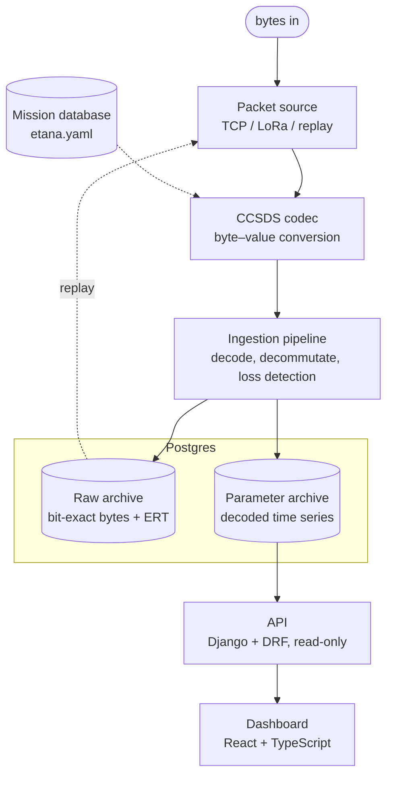

# Ground Segment

Receives, decodes, archives, and displays Eagle-1 telemetry. Python ingestion,
Django/DRF API, React/TypeScript dashboard, Postgres storage.

> **Status.** In development, Phase 0 (CCSDS codec).

## Architecture



The system has two independent paths meeting at Postgres. The ingestion pipeline
(packet source → codec → archive) is a long-running Python service. The read path
(database → API → dashboard) is read-only and does not touch ingestion. The
dashboard can fail without affecting ingestion, and ingestion runs without a UI.

The transport is abstracted behind the packet-source interface: `TcpPacketSource`
during development, `LoRaPacketSource` in flight, `ReplayPacketSource` for
re-processing stored data. Nothing downstream of the interface depends on the
source.

## Components

| Component | Responsibility | Stack |
|-----------|---------------|-------|
| Packet source | Transport abstraction; yields byte frames | Python |
| CCSDS codec | Byte–value conversion per the mission database; no I/O | Python |
| Ingestion pipeline | Decode, write both archive tiers, per-APID loss detection | Python |
| Raw archive | Bit-exact received bytes, Earth-receive time, link stats | Postgres |
| Parameter archive | Decoded, calibrated time series; regenerable from raw | Postgres |
| API | Read-only REST over the archive | Django + DRF |
| Dashboard | Map, plots, loss indicators | React + TS |

## Structure

Populated per phase (see [`../docs/DESIGN.md`](../docs/DESIGN.md)):

```
ground-segment/
├── packages/
│   └── ccsds/          # mission-database-driven codec (Phase 0)
├── services/
│   ├── simulator/      # development telemetry source over TCP (Phase 1)
│   ├── ingestion/      # packet source -> codec -> archive -> loss detection (Phase 1-2)
│   └── api/            # Django + DRF read API (Phase 3)
└── frontend/           # React + TypeScript dashboard (Phase 3)
```

## Phase 0

CCSDS codec: load and validate `mdb/etana.yaml`, pack/unpack the CCSDS primary
header, and drive field encode/decode from the mission database. Exit criterion:
a round-trip test (encode → decode → assert equal). Depends only on the mission
database at [`../mdb/etana.yaml`](../mdb/etana.yaml).
